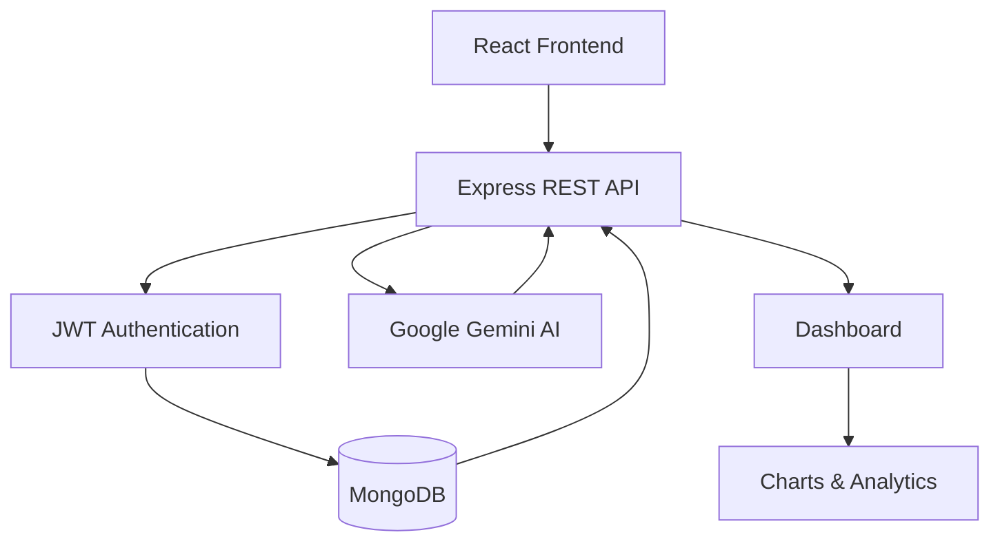
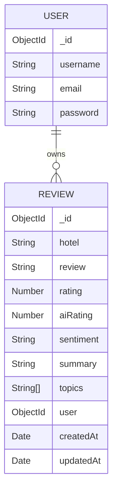
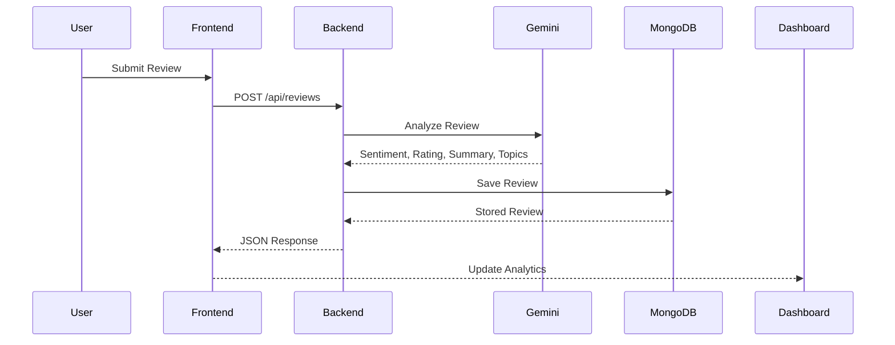

# 🏨 Classic Insight – AI-Powered Hotel Review Analytics Platform

<p align="center">


</p>

> **Classic Insight** is an AI-powered hotel review analytics platform that helps hospitality businesses collect, organize, analyze, and visualize customer feedback using **Google Gemini AI**. By combining Full Stack Development with Artificial Intelligence, the platform transforms raw customer reviews into meaningful insights that support better business decisions.

---

# 📖 Table of Contents

- [Project Overview](#-project-overview)
- [Problem Statement](#-problem-statement)
- [Why I Built This Project](#-why-i-built-this-project)
- [Features](#-features)
- [Technology Stack](#-technology-stack)
- [System Architecture](#-system-architecture)
- [Database Schema](#-database-schema)
- [Folder Structure](#-folder-structure)
- [Installation Guide](#-installation-guide)
- [Environment Variables](#-environment-variables)
- [How to Use](#-how-to-use)
- [AI Review Analysis Workflow](#-ai-review-analysis-workflow)
- [Dashboard Overview](#-dashboard-overview)
- [Screenshots](#-screenshots)
- [Future Enhancements](#-future-enhancements)
- [Contributing](#-contributing)

---

# 📌 Project Overview

Classic Insight is a full-stack web application built for hotel businesses that need an efficient way to understand customer feedback.

Instead of manually reading hundreds of reviews, hotel owners can upload reviews, submit them manually, or import them from CSV files. The application stores these reviews in MongoDB and uses **Google Gemini AI** to analyze each review.

For every review, AI generates:

- 😊 Sentiment
- ⭐ AI-generated Rating
- 📝 Review Summary
- 🏷️ Key Topics

These insights are displayed through a dashboard, making it easier for hotel management to identify trends, recurring complaints, and positive guest experiences.

---

# ❓ Problem Statement

Hotels receive large volumes of customer reviews from multiple platforms.

Analyzing this feedback manually presents several challenges:

- Reading thousands of reviews consumes significant time.
- Hidden trends are difficult to identify.
- Customer complaints may remain unnoticed.
- Valuable feedback is often underutilized.
- Business decisions rely on incomplete information.

Classic Insight addresses these challenges by using Artificial Intelligence to automatically convert unstructured reviews into structured insights that are easier to understand and act upon.

---

# 💡 Why I Built This Project

I built Classic Insight to combine **Artificial Intelligence** with **Full Stack Web Development** in a practical business application.

Through this project, I wanted to strengthen my understanding of:

- React.js
- Node.js
- Express.js
- MongoDB
- REST API Development
- JWT Authentication
- Google Gemini API
- AI Integration
- Dashboard Design
- Data Visualization
- Frontend–Backend Communication

This project demonstrates how AI can help hotel businesses make faster, data-driven decisions by transforming customer feedback into actionable insights.

---

# ✨ Features

## 🔐 Authentication

- User Registration
- User Login
- JWT Authentication
- Protected API Routes
- Password Encryption (bcrypt)

---

## 📝 Review Management

- Submit Reviews Manually
- Store Reviews in MongoDB
- Update Reviews
- Delete Reviews
- Search Reviews
- User-specific Review Storage

---

## 📄 CSV Upload

- Upload CSV Files
- Parse Review Data
- Import Multiple Reviews
- Analyze Uploaded Reviews

---

## 🤖 AI Review Analysis

Google Gemini AI automatically generates:

- Sentiment Analysis
- AI Rating
- Review Summary
- Topic Extraction

---

## 📊 Dashboard

The dashboard provides an overview of:

- Total Reviews
- Average Rating
- Sentiment Distribution
- Review Trends
- Recent Reviews
- AI Insights

---

## 💬 AI Assistant

A floating AI chat assistant is being integrated to answer hotel review–related questions using Google Gemini.

---

## 🌙 User Experience

- Responsive Interface
- Dark / Light Mode
- Clean Dashboard
- Interactive Analytics

---

# 🛠 Technology Stack

| Category | Technologies |
|-----------|-------------|
| Frontend | React.js |
| Styling | Tailwind CSS |
| Backend | Node.js, Express.js |
| Database | MongoDB, Mongoose |
| Authentication | JWT, bcrypt |
| AI | Google Gemini API (`@google/genai`) |
| Charts | SVG / React Components |
| CSV Parsing | Papa Parse |
| Environment | dotenv |
| Development | Nodemon |

---

# 🏗 System Architecture



---

# 🗄 Database Schema



---

# 📂 Folder Structure

```
Classic-Insight/

│

├── backend/

│ ├── config/

│ ├── controllers/

│ ├── middleware/

│ ├── models/

│ ├── routes/

│ ├── services/

│ ├── server.js

│ └── package.json

│

├── frontend/

│ ├── src/

│ │ ├── components/

│ │ ├── pages/

│ │ ├── assets/

│ │ └── App.jsx

│ └── package.json

│

└── README.md
```

---

# 🚀 Installation Guide

## Clone Repository

```bash
git clone https://github.com/YOUR_USERNAME/Classic-Insight.git
```

---

## Install Frontend

```bash
cd frontend

npm install
```

---

## Install Backend

```bash
cd backend

npm install
```

---

## Install Gemini SDK

```bash
npm install @google/genai
```

---

## Configure Environment Variables

Create:

```
backend/.env
```

---

## Start Backend

```bash
npm run dev
```

---

## Start Frontend

```bash
npm run dev
```

---

# 🔑 Environment Variables

| Variable | Description |
|----------|-------------|
| PORT | Backend Port |
| MONGO_URI | MongoDB Connection String |
| JWT_SECRET | Secret Key for JWT |
| GEMINI_API_KEY | Google Gemini API Key |

---

# 📖 How to Use

### 1️⃣ Register

Create a new account.

### 2️⃣ Login

Authenticate using your email and password.

### 3️⃣ Submit Reviews

- Paste reviews manually
- Upload CSV reviews

### 4️⃣ Analyze Reviews

Google Gemini generates:

- Sentiment
- Rating
- Summary
- Topics

### 5️⃣ View Dashboard

Analyze hotel performance using AI-generated insights and visualizations.

### 6️⃣ Ask the AI Assistant

Use the floating chat assistant to ask questions about hotel reviews and customer feedback.

---

# 🤖 AI Review Analysis Workflow



---

# 📊 Dashboard Overview

The dashboard is designed to provide hotel managers with quick insights into customer satisfaction.

Key metrics include:

- ⭐ Average Rating
- 😊 Sentiment Distribution
- 📈 Review Trends
- 📝 Recent Reviews
- 🏷️ Common Topics
- 🤖 AI Insights


---

## 🤖 AI Chat

> *Add screenshot here*

---

## 📈 Sentiment Analysis

> *Add screenshot here*

---

# 🚀 Future Enhancements

- Real-time dashboard analytics
- Competitor comparison
- PDF report generation
- CSV report export
- Email summaries
- Role-based authentication
- Trend forecasting
- Predictive analytics
- Multilingual review analysis
- Voice review analysis
- AI recommendations for hotel management
- Roi calculations

---

# 🤝 Contributing

Contributions are welcome.

1. Fork the repository.
2. Create a new branch.

```bash
git checkout -b feature/new-feature
```

3. Commit your changes.

```bash
git commit -m "Add new feature"
```

4. Push the branch.

```bash
git push origin feature/new-feature
```

5. Open a Pull Request.

---

# 👥 Authors

Developed collaboratively as part of a full-stack academic project.

---

# ⭐ Acknowledgements

- Google Gemini AI
- MongoDB Atlas
- React
- Express.js
- Node.js
- Tailwind CSS

---

<p align="center">
Author:Gauri sharma

</p>